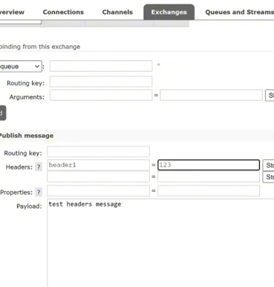
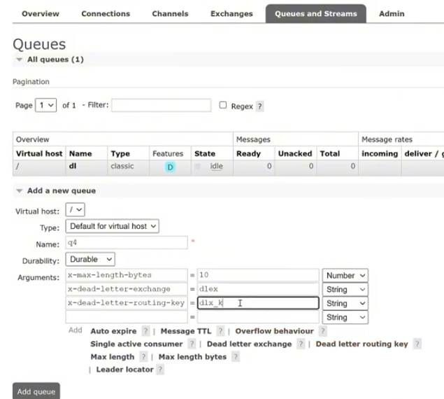
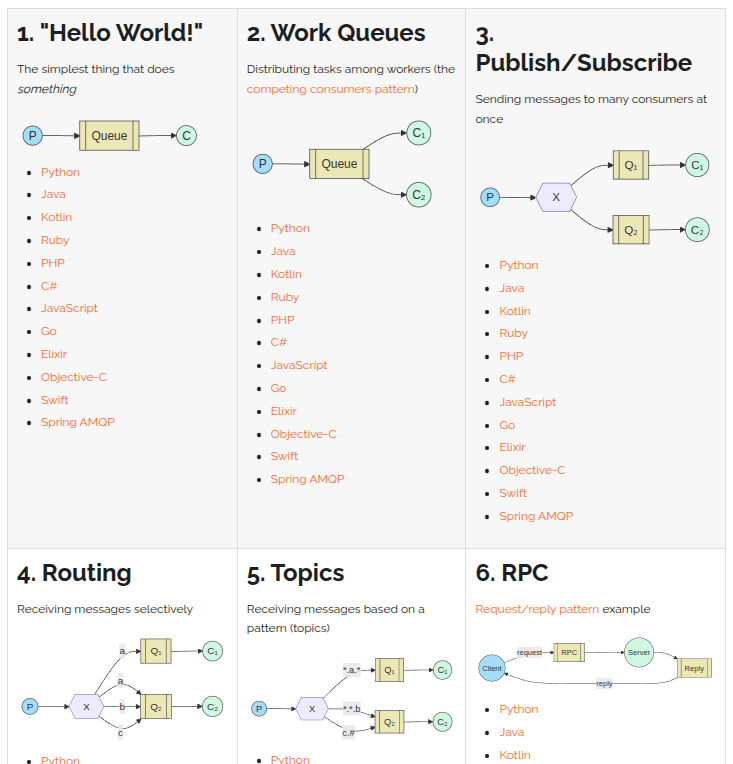

<h2>RabbitMQ</h2>

RabbitMQ — брокер сообщений, который обеспечивает асинхронный обмен 
данными между различными элементами системы. 
Брокер — это посредник, который доставляет данные от продюсера получателю, управляет очередью, 
осуществляет маршрутизацию и хранение данных.
Основанн на протоколе прикладного уровня AMQP. Организованна по принципу FIFO.

Некоторые компоненты брокера RabbitMQ:

- Producer — приложение или процесс, который отправляет сообщения в RabbitMQ.
- Exchange — получает сообщения от производителей и направляет их в очереди на основе правил маршрутизации.
- Queue — место хранения сообщений до тех пор, пока их не заберёт потребитель.
- Consumer — приложение или процесс, который получает сообщения из очереди и обрабатывает их.

Принцип работы Алгоритм работы брокера RabbitMQ:
- Продюсер направляет сообщение в обменник.
- Обменник назначает нужную очередь и отправляет в неё сообщение.
- Получатель подписывается на очередь, чтобы принять сообщение.
- Получатель принимает сообщение и обрабатывает его.
- Получатель отправляет подтверждение о том, что принял сообщение.
- Если получатель не отправил подтверждение о доставке, сообщение возвращается обратно в свою очередь.

Шина данных - это брокер сообщений, который обеспечивает обмен данными (kafka, rabbitmq).

Типы обменников:
- default - к нему по умолчанию привязанны все очереди
- direct - по routing key отправляет данные в очередь
- fanout - во все очередя
- topic - по шаблону #|*
- headers - по routing headers отправляет данные в очередь 
- deadletter

headers:

ddl:

Реализации:

